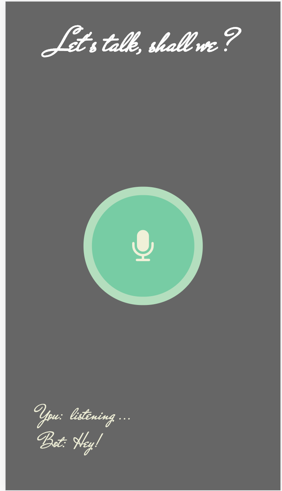

# ai-chatbot
Bot that listens & talk back, powered by [API.AI](https://api.ai/)

### How it works ?
1. Recognise the input voice using [SpeechRecognition api](https://developer.mozilla.org/en-US/docs/Web/API/SpeechRecognition)
2. Send the recognised text to the express server using [socket.io](http://socket.io/)
3. Server uses API.AI's node sdk wrapper [apiai-nodejs-client](https://github.com/api-ai/apiai-nodejs-client) to find relevant response for the input provided.
4. Server sends the response back using socket emit.
5. Client captures the response & Use [SpeechSynthesis api](https://developer.mozilla.org/en-US/docs/Web/API/SpeechSynthesis) to convert the text to voice.

Resulting in a conversation. 🗣

### Look


### Inspiration & helpful links
1. [Smashing magazine article](https://www.smashingmagazine.com/2017/08/ai-chatbot-web-speech-api-node-js)
2. [Heroku nodejs deployment instructions](https://devcenter.heroku.com/articles/getting-started-with-nodejs#introduction)

### Try with a local server
Rename the `.env-test` to `.env` and fill the env vars:

```
APIAI_TOKEN=your_token
APIAI_SESSION_ID=some_unique_session_id
```

The first one is an API.ai API key (Please get one by sign up with [dialogflow](console.dialogflow.com/api-client)), and the second one is a session ID, which is an arbitrary string.
